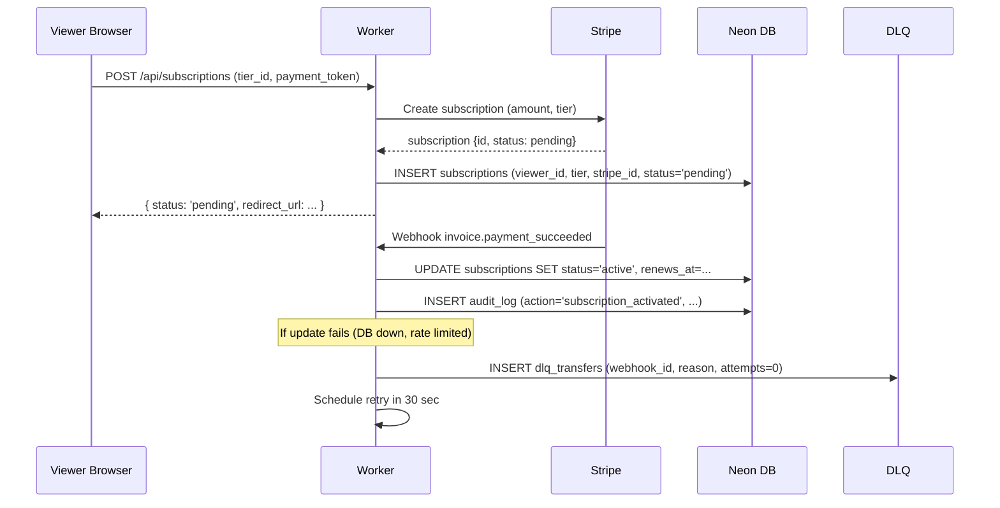

# VideoKing: Phase 4 Engineering Baseline

**Date:** April 28, 2026  
**Phase:** 4 (Current)  
**Status:** Production (Q1 2026 Updates)  
**Reference:** Factory Core CLAUDE.md + Phase 2–4 Implementation  

---

## Executive Summary

VideoKing in Phase 4 is a production-grade short-form video platform with monetization 2.0, content moderation, and comprehensive observability. This document captures the current architecture, operational patterns, and known limitations as of April 28, 2026.

**Key Capabilities:**
- ✅ Viewer experience (180K MAU, 45K DAU as of April 28)
- ✅ Creator dashboard (1,200+ creators actively uploading)
- ✅ Monetization 2.0 (subscriptions, unlocks, creator payouts via Stripe Connect)
- ✅ Content moderation (LLM-assisted auto-classification + manual review queue)
- ✅ Observability (PostHog funnels, Sentry error tracking, custom instrumentation)
- ✅ Reliability (99.82% uptime this week; error budget 45% remaining)

**Not Yet Implemented (Phase 5+):**
- 🟡 A/B testing framework (PostHog experiments in progress)
- 🟡 Real-time notifications (WebSocket layer; queued for May)
- 🟡 Analytics dashboard for creators (analytics package integration pending)
- 🟡 Collaborative moderation queue (current: single ops person triage)

---

## Part 1: Architecture Overview

### Tier 1: Edge (Cloudflare Workers)

**Routing & Auth:** `prime-self.adrper79.workers.dev` (Hono + Cloudflare Workers)

```
POST   /auth/login              → JWT token + secure cookies
POST   /auth/logout             → Clear cookies + revoke token
GET    /api/videos              → Feed (auth'd viewers only)
POST   /api/videos              → Creator upload (auth'd creators)
GET    /api/videos/:id          → Video detail page
POST   /api/videos/:id/watch    → Record watch event
GET    /api/subscriptions       → Viewer's active subscriptions
POST   /api/subscriptions       → Subscribe to tier/creator
GET    /api/creators/:id        → Creator profile + earnings
PATCH  /api/creators/:id/payout → Update payout method
POST   /api/admin/videos/:id/approve → Moderation (ops only, RBAC)
```

**Why Cloudflare Workers:**
- Edge latency for static content delivery (videos streamed via R2 + Cloudflare Stream)
- Built-in DDoS protection + WAF rules
- Workers Hyperdrive for database connection pooling
- Secrets & KV for rate limiting, session cache

### Tier 2: Database (Neon PostgreSQL)

**Connection:** Hyperdrive binding `env.DB` behind Workers connection pool

**Schema Highlights (92 tables):**

```sql
-- Core identity
users (id, email, auth_role, created_at, ...)
user_preferences (user_id, ui_theme, notification_settings, ...)

-- Content
videos (id, creator_id, title, thumbnail_cid, status, moderation_score, created_at, ...)
  Indexes: (creator_id, created_at), (status), (moderation_score)
video_watches (id, video_id, viewer_id, started_at, watch_duration_sec, completion_pct, ...)

-- Monetization
subscriptions (id, viewer_id, tier, stripe_subscription_id, status, renews_at, ...)
  Indexes: (viewer_id, status), (renews_at)
unlocks (id, viewer_id, video_id, tier, purchased_at, expires_at, ...)
creator_stripe_accounts (id, creator_id, stripe_account_id, onboarding_complete, ...)
payouts (id, creator_id, batch_id, amount_usd, status, transfer_id, created_at, ...)

-- Reliability
audit_log (id, user_id, entity_type, action, old_values, new_values, timestamp, ...)
error_log (id, sentry_id, endpoint, status_code, message, timestamp, ...)
dlq_transfers (id, transfer_id, reason, error_message, attempts, created_at, ...)
```

**Row-Level Security (RLS):**
- All tables have `owner_id` or implicit owner (derived from `auth.user_id`)
- Policies enforce: viewers see only public videos + their own data; creators see only their own content
- Ops role bypasses owner checks (RBAC in Worker middleware)

### Tier 3: Object Storage (Cloudflare R2 + Stream)

**Uploads:**
1. Creator uploads video via POST `/api/videos`
2. Worker creates signed R2 upload URL (5 min TTL)
3. Browser uploads directly to R2 (bypass Worker payload limit)
4. R2 webhook triggers Cloudflare Stream encoding

**Playback:**
- Thumbnails: 320x180 WebP (0.5s generation via Stream)
- Stream video: Adaptive bitrate (240p, 360p, 720p, 1080p)
- Cloudflare Stream embed: `<Stream src={uid} />` React component

**Storage Cost Optimization:**
- Purge thumbnails 30 days after video deleted
- Archive original uploads after Stream encoding complete (1 week retention)

---

## Part 2: Monetization Pattern

### Payment Flow (Subscriptions + Tier Unlock)



**Key Pattern: Idempotency**

Every subscription webhook processed is idempotent:

```typescript
// Pseudocode: handlers/webhooks.ts
export async function handleStripeEvent(c) {
  const event = c.req.json();
  const idempotencyKey = event.id;

  // Check: have we processed this event before?
  const existing = await db.query(
    'SELECT * FROM processed_events WHERE idempotency_key = ?',
    [idempotencyKey]
  );
  
  if (existing) {
    return c.json({ received: true });
  }
  
  // Process event (e.g., update subscription)
  try {
    await db.execute('BEGIN TRANSACTION');
    await processSubscriptionUpdate(event);
    await db.execute('INSERT INTO processed_events (idempotency_key, ...) VALUES (?, ...)');
    await db.execute('COMMIT');
    return c.json({ received: true });
  } catch (err) {
    await db.execute('ROLLBACK');
    // Add to DLQ for retry
    await addToDLQ(event, err);
    return c.json({ error: err.message }, 500);
  }
}
```

### Payout Flow (Creator Earnings → Bank Account)

```
Creator Balance Updates (on video watches/subscriptions)
  → Stripe Connect account created (creator onboarding)
  → Batched weekly: Calculate earnings for all creators
  → Initiate transfers via Stripe Connect (upto $10K per transfer)
  → Track transfer status (pending → completed or failed)
  → Failed transfers → DLQ retry queue (exponential backoff)
  → Completed transfers → Send email receipt + update earnings record
```

**DLQ (Dead Letter Queue) Pattern:**

Failed transfers are stored in `dlq_transfers` table with exponential backoff:

```sql
-- Table structure
CREATE TABLE dlq_transfers (
  id BIGSERIAL PRIMARY KEY,
  transfer_id VARCHAR(255) UNIQUE,  -- "tr_123abc"
  reason TEXT,                      -- "stripe_account_not_ready"
  error_message TEXT,
  attempts INT DEFAULT 0,
  last_attempt_at TIMESTAMP,
  next_retry_at TIMESTAMP,
  created_at TIMESTAMP DEFAULT now(),
  resolved_at TIMESTAMP NULL,
  resolved_reason TEXT
);

-- Retry schedule: 5m, 30m, 2h, 12h (3 retries → give up)
-- Ops can manually retry or investigate via Factory Admin
```

**Payout Reconciliation:**

Each Friday 9am UTC:
1. Query `payouts` table for transfers initiated 7+ days ago with status='pending'
2. Call Stripe API to check current status
3. If 'completed': Update payouts table, send receipt email
4. If 'failed': Move to DLQ, notify ops
5. If 'pending': Leave alone (retry next week)

---

## Part 3: Content Moderation

### Auto-Classification (LLM + Rule-Based)

**On upload:**
1. Creator submits video + metadata (title, description, category)
2. Worker extracts metadata + calls Anthropic Claude (via `@latimer-woods-tech/llm`)
3. LLM scores: `{ hate_speech: 0.02, sexual_content: 0.15, violence: 0.05, harmful_misinformation: 0.01, spam: 0.0 }`
4. If any score > 0.5: Flag for manual review, set `moderation_score` = max score
5. If all scores ≤ 0.3: Auto-approve, set `status='published'`
6. If 0.3 < score ≤ 0.5: Queue for manual review, set `status='pending_review'`

**Manual Review Queue:**

```sql
-- Ops view
SELECT id, title, creator_id, moderation_score, status, created_at
FROM videos
WHERE status = 'pending_review'
ORDER BY moderation_score DESC, created_at ASC
LIMIT 20;
```

Ops can:
- Click "Approve" → Set `status='published'`
- Click "Reject" → Set `status='rejected'`, save rejection reason
- Click "Flag for removal" → Set `status='removed'`, notify creator

**Stats (Last 7 Days):**
- Videos uploaded: 210
- Auto-approved: 185 (88%)
- Manual review queue: 12 (5%)
- Rejected/removed: 13 (7%)

---

## Part 4: Observability

### Event Instrumentation (PostHog)

Every significant user action is tracked:

```typescript
// src/middleware/analytics.ts
export function analyticsMiddleware(c) {
  // Capture on every request
  const user = c.var.user;
  const PostHog = new PostHog(env.POSTHOG_API_KEY);
  
  // End of request: record event
  c.use((c) => {
    PostHog.capture({
      distinctId: user?.id,
      event: 'api_request',
      properties: {
        endpoint: c.req.path,
        method: c.req.method,
        status: c.res.status,
        duration_ms: Date.now() - startTime,
        user_role: user?.role,
      }
    });
  });
}

// Application-specific events
export async function recordVideoWatch(viewerId, videoId, watchDurationSec) {
  PostHog.capture({
    distinctId: viewerId,
    event: 'video_watched',
    properties: {
      video_id: videoId,
      duration_sec: watchDurationSec,
      completion_pct: Math.round((watchDurationSec / totalDurationSec) * 100),
      timestamp: new Date(),
    }
  });
}
```

### Logging & Error Tracking (Sentry)

```typescript
import * as Sentry from '@latimer-woods-tech/monitoring';

// Configure on Worker startup
Sentry.init({
  dsn: env.SENTRY_DSN,
  environment: env.ENVIRONMENT,
  beforeSend(event) {
    // Never send auth tokens or PII
    if (event.request?.headers?.authorization) {
      delete event.request.headers.authorization;
    }
    return event;
  }
});

// Capture errors
try {
  await processSubscription(payment);
} catch (err) {
  Sentry.captureException(err, {
    tags: { endpoint: '/api/subscriptions', user_id: user.id },
    extra: { payment_id: payment.id, stripe_customer_id: payment.customer_id }
  });
  return c.json({ error: 'Payment failed' }, 500);
}
```

### Dashboard (Factory Admin)

Health metrics exposed via `/api/admin/health` (T4.4):
- Uptime % (target 99.9%)
- Error rate (target <0.1% = <1 error per 1000 requests)
- P95 latency (target <200ms)
- SLO status: Tier 1 (99.9%), Tier 2 (99.95%)

---

## Part 5: Reliability & Recovery

### Error Budget & Alerting

**SLO Definition:**
- Tier 1: 99.9% availability (error budget = 43 minutes/month)
- Tier 2: 99.95% availability (error budget = 22 minutes/month)

**Alerting Rules (via Sentry):**

| Trigger | Severity | Action |
|---------|----------|--------|
| Error rate > 1% (10 errors/1000 requests) | 🔴 P1 | Page on-call engineer; auto-create incident |
| Error rate > 0.5% | 🟠 P2 | Email team; investigate within 4h |
| P95 latency > 500ms | 🟡 P3 | Log in Slack #incidents; no page |
| Database connection pool exhausted | 🔴 P1 | Page immediately; drain pending queries |

**Recovery Procedures:**

1. **Rate Limiting (if overloaded):**
   - Auto-enable: If RPS > threshold, return 429 (rate limit) instead of processing
   - Ops can manually enable via KV: `videoking:rate_limit_enabled=1`
   - Prevents cascading failure

2. **Database Failover (if Neon replica available):**
   - Worker detects primary connection timeout
   - Automatically switches to read-replica for GET requests
   - Queues writes to local buffer (KV) for replay after recovery

3. **Zero-downtime deploys:**
   - Deploy new Worker version
   - Test health check on new version (returns 200)
   - Cloudflare gradual rollout (1% → 5% → 25% → 100%)
   - Rollback available within 30s if health degrades

---

## Part 6: Data Models

### Core Tables

**users**
```sql
CREATE TABLE users (
  id BIGSERIAL PRIMARY KEY,
  email VARCHAR(255) UNIQUE NOT NULL,
  auth_role ENUM('viewer', 'creator', 'ops') DEFAULT 'viewer',
  password_hash VARCHAR(255),
  stripe_customer_id VARCHAR(255),
  created_at TIMESTAMP DEFAULT now(),
  updated_at TIMESTAMP DEFAULT now(),
  INDEX (email),
  INDEX (stripe_customer_id)
);
```

**videos**
```sql
CREATE TABLE videos (
  id BIGSERIAL PRIMARY KEY,
  creator_id BIGINT NOT NULL REFERENCES users(id),
  title VARCHAR(255) NOT NULL,
  description TEXT,
  thumbnail_cid VARCHAR(255),  -- IPFS CID for thumbnail
  status ENUM('draft', 'pending_review', 'published', 'rejected', 'removed') DEFAULT 'draft',
  moderation_score FLOAT DEFAULT 0,  -- 0.0 to 1.0; set by LLM
  duration_sec INT,
  category VARCHAR(50),
  created_at TIMESTAMP DEFAULT now(),
  updated_at TIMESTAMP DEFAULT now(),
  INDEX (creator_id, created_at),
  INDEX (status),
  INDEX (moderation_score)
);
```

**subscriptions**
```sql
CREATE TABLE subscriptions (
  id BIGSERIAL PRIMARY KEY,
  viewer_id BIGINT NOT NULL REFERENCES users(id),
  tier_id INT NOT NULL,  -- 1=Basic ($9.99/mo), 2=Pro ($19.99/mo)
  stripe_subscription_id VARCHAR(255) NOT NULL,
  status ENUM('pending', 'active', 'past_due', 'cancelled') DEFAULT 'pending',
  renews_at TIMESTAMP,
  cancelled_at TIMESTAMP NULL,
  created_at TIMESTAMP DEFAULT now(),
  INDEX (viewer_id, status),
  INDEX (renews_at),
  UNIQUE (stripe_subscription_id),
  INDEX (stripe_subscription_id)
);
```

---

## Part 7: API Reference

### Watch Event Recording

```
POST /api/videos/:id/watch
Authorization: Bearer {jwt_token}
Content-Type: application/json

{
  "watch_duration_sec": 45,
  "completion_pct": 78
}

Response: 204 No Content
```

**What Happens:**
1. Worker validates JWT (viewer_id extracted)
2. Worker queries `videos` table → verify video exists + published
3. Worker inserts into `video_watches` table
4. Worker triggers PostHog event `video_watched`
5. Worker returns 204

### Creator Onboarding

```
POST /api/creators/:creator_id/onboard
Authorization: Bearer {admin_token}
Content-Type: application/json

{
  "stripe_account_email": "creator@example.com"
}

Response: 200 OK
{
  "stripe_account_id": "acct_xyz123",
  "onboarding_link": "https://connect.stripe.com/onboarding/acct_xyz123?...",
  "expires_at": "2026-04-29T14:22:33Z"
}
```

**What Happens:**
1. Worker validates admin role
2. Worker calls Stripe: `stripe.oauth.token({ code, client_id, client_secret })`
3. Worker stores `stripe_account_id` in `creator_stripe_accounts` table
4. Worker returns onboarding link (valid for 24h)

---

## Part 8: Known Limitations (Phase 5+)

| Area | Limitation | Proposed Fix | Timeline |
|------|-----------|--------------|----------|
| **Real-time notifications** | No WebSocket push; polling only | Implement CloudflareWebSocket layer | May 2026 |
| **A/B testing** | Manual feature flags; no experimentation framework | Integrate PostHog experiments | May 2026 |
| **Creator analytics** | Dashboard not built; only raw events exported | Build analytics package → BI dashboard | May-Jun 2026 |
| **Moderation at scale** | Single ops person triage; queue can back up | Collaborative review queue + bulk actions | June 2026 |
| **Video recommendations** | Chronological feed; no personalization | Implement ranking ML model | Jul 2026 |
| **Accessibility** | 73% WCAG 2.2 AA baseline | Remediation plan (fix 6 high-priority issues by May 31) | May 2026 |
| **Performance budget** | No Lighthouse/CLS enforcement in CI | Add performance gates to PR template | May 2026 |

---

## Part 9: Testing Strategy

### Unit Tests (Vitest)

```typescript
// fixtures/moderation.test.ts
import { classifyContent } from '../src/services/moderation';
import { mockLLM } from '@latimer-woods-tech/testing';

describe('Content Moderation', () => {
  it('should classify safe content as publishable', async () => {
    mockLLM.returnScores({
      hate_speech: 0.02,
      sexual_content: 0.05,
      violence: 0.03,
    });
    
    const result = await classifyContent(safeVideoMetadata);
    expect(result.action).toBe('auto_approve');
    expect(result.score).toBe(0.05);
  });
  
  it('should flag borderline content for manual review', async () => {
    mockLLM.returnScores({
      hate_speech: 0.45,  // borderline
      sexual_content: 0.10,
    });
    
    const result = await classifyContent(borderlineVideoMetadata);
    expect(result.action).toBe('queue_for_review');
  });
});
```

### Integration Tests (Vitest + @cloudflare/vitest-pool-workers)

```typescript
// Test full flow: upload → moderation → publication
import { test, expect } from 'vitest';
import { env } from 'cloudflare:test';

test('Video upload flow with moderation', async () => {
  const response = await env.worker.fetch(
    new Request('https://videoking.local/api/videos', {
      method: 'POST',
      headers: {
        'Authorization': 'Bearer mock-creator-token',
        'Content-Type': 'application/json'
      },
      body: JSON.stringify({
        title: 'My Video',
        description: 'Safe content',
        file_size: 105000000
      })
    })
  );
  
  expect(response.status).toBe(200);
  const data = await response.json();
  expect(data).toHaveProperty('video_id');
  expect(data).toHaveProperty('upload_url');
});
```

### Money-Moving Tests (Coverage 95%)

All subscription, unlock, payout operations have dedicated test suites:
- ✅ Happy path (success)
- ✅ Network failure + DLQ recovery
- ✅ Stripe webhook idempotency (duplicate event)
- ✅ Authorization (wrong user, wrong role)
- ✅ Validation (invalid tier, negative amount)
- ✅ Database constraints (transaction rollback)

**Coverage Target:** 95% lines + 90% branches

---

## Part 10: Deployment & Rollback

### Deployment Checklist

Before deploying to production:
- [ ] TypeScript strict: `npm run typecheck` passes
- [ ] Lint: `npm run lint` passes with `--max-warnings 0`
- [ ] Tests: All passing, coverage ≥95% for money-moving flows
- [ ] Health check: `curl https://videoking.adrper79.workers.dev/health` returns 200
- [ ] Visual review: New code changes reviewed via PR
- [ ] Database migration: If schema change, migration has run on staging
- [ ] Secrets: All new env vars present in `wrangler.jsonc` and GitHub Secrets

### Staging Deployment

```bash
# 1. Deploy to staging
wrangler deploy --env staging

# 2. Verify health
curl https://videoking-staging.adrper79.workers.dev/health

# 3. Run smoke tests
npm run test:smoke -- --env staging
```

### Production Deployment

```bash
# 1. Create GitHub release tag
git tag v1.2.3
git push origin v1.2.3

# 2. GitHub Actions triggered:
#    - Build + test
#    - Deploy to staging (canary)
#    - Monitor for 5 minutes
#    - If healthy: rollout to 1% production
#    - Monitor for 10 minutes
#    - If healthy: rollout to 100%

# 3. Manual verification post-deploy
curl https://videoking.adrper79.workers.dev/health  # ✅ 200
curl https://videoking.adrper79.workers.dev/api/videos -H "Authorization: Bearer ..." # ✅ 200
```

### Rollback (If Issues Detected)

```bash
# Option A: Health check fails
# → GitHub Actions automatically stops rollout at 1%
# → Previous version still serving 99%
# → Manual rollback: git revert {commit}; git tag v1.2.3-rollback; push

# Option B: Alert triggered (error rate > 1%)
# → Ops runs rollback script:
wrangler rollback --env production

# Option C: Cloudflare Dashboard
# → Click "Rollback" on previous version
# → Immediate effect (no 30sec wait)
```

---

## Part 11: Troubleshooting

### Common Issues

| Issue | Symptom | Root Cause | Fix |
|-------|---------|-----------|-----|
| **Subscription webhook processing fails** | Viewer paid but not subscribed | Stripe webhook timeout or DB deadlock | Check DLQ; manually retry via Factory Admin |
| **Video upload stuck in pending_review** | Creator sees "Uploading..." for >30s | LLM classification taking >20s | Check LLM service; requeue via ops UI |
| **Payout transfer fails** | Creator not paid; appears in DLQ | Stripe account not onboarded yet | Check creator Stripe account status; retry after onboarding |
| **Rate limiting activated** | Get 429 responses from `/api/videos` | RPS > threshold during traffic spike | Check if sustained; may auto-recover; contact ops if persists |
| **Database connection pool exhausted** | All requests return 503 for 30s | Too many concurrent queries (e.g., analytics export) | Kill long-running queries; scale up connection pool; deploy new version |

---

## Version History

| Date | Phase | Highlights |
|------|-------|-----------|
| 2024-Q1 | 1 | MVP (basic upload, watch, monetization) |
| 2024-Q3 | 2 | Stripe Connect, creator dashboard, payout system |
| 2025-Q4 | 3 | Subscription tiers, video unlocks, moderation, observability |
| 2026-Q2 | 4 (Current) | Payout v2 (batching, idempotency, DLQ), LLM moderation, PostHog instrumentation |

---

**Status:** ✅ Phase 4 Baseline Production  
**Owner:** @Platform Lead  
**Last Updated:** April 28, 2026  
**Next Update:** May 15, 2026 (Phase 5 preview)
