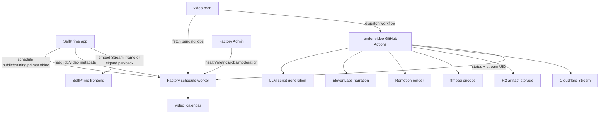

# SelfPrime × VideoKing Synergy Development Plan

**Date:** 2026-04-28  
**Owner:** Factory Platform + SelfPrime Product + VideoKing Product  
**Status:** Planning baseline — implementation requires service health reconciliation first  
**Related systems:** SelfPrime (`selfprime.net` / `api.selfprime.net`), Factory video automation, VideoKing, Factory Admin

---

## 1. Executive Decision

SelfPrime and VideoKing have strong product and infrastructure synergies, but the integration should not make either application dependent on the other's app-specific runtime.

**Decision:**

1. **Shared capabilities go into Factory.**
   - Video infrastructure, scheduling, Stream/R2 helpers, monetization contracts, moderation contracts, telemetry contracts, operator UI patterns, testing utilities, and runbooks belong in Factory packages, Factory apps, and Factory documentation.
2. **SelfPrime-specific experiences stay in SelfPrime.**
   - Practitioner onboarding, chart-specific video generation, practitioner video library UX, landing-page embeds, client deliverables, and tier gating belong in the SelfPrime application environment.
3. **VideoKing remains a standalone product environment.**
   - VideoKing should remain its own app with its own users, creator marketplace, moderation, payouts, and operational lifecycle.
4. **No new environment is required for Phase 1.**
   - Phase 1 should use existing Factory video automation plus SelfPrime integration.
5. **Create a dedicated environment only if the synergy becomes a cross-app product.**
   - If “Practitioner Video Studio” becomes a shared commercial product used by multiple Factory apps, promote it to a dedicated Factory service/app with app-level tenancy, not a hidden feature inside SelfPrime or VideoKing.

### Short answer: where do the synergies go?

| Synergy | Destination | Reason |
|---|---|---|
| Stream/R2 wrappers | Factory package: `@latimer-woods-tech/video` | Shared infrastructure, reusable by all apps |
| Video calendar and queue | Factory package: `@latimer-woods-tech/schedule` + `apps/schedule-worker` | Shared scheduling infrastructure |
| Render pipeline | Factory workflow + `apps/video-studio` | Centralized non-Worker compute for Remotion/ffmpeg |
| Landing-page walkthrough video | SelfPrime frontend | Product-specific presentation |
| Practitioner training library | SelfPrime app, backed by Factory video services | Product-specific UX using shared video infrastructure |
| Personalized chart-summary videos | SelfPrime app, backed by Factory video services | Uses SelfPrime chart/profile data and privacy model |
| Creator monetization patterns | Factory contracts, then SelfPrime implementation | Pattern is reusable; business rules are app-specific |
| Payout/revenue-share operations | Factory runbooks/contracts + app-specific ledgers | Avoid cross-app financial coupling |
| Moderation patterns | Factory contract/package candidate + per-app policy | Shared pipeline, app-specific policy thresholds |
| Operator dashboard patterns | Factory design/admin patterns | Multi-app admin consistency |
| VideoKing public marketplace | VideoKing environment | Separate product and audience |

---

## 2. Current-State Findings

### SelfPrime

SelfPrime is production operational and positioned around:

- Free Energy Blueprint calculation.
- AI-assisted synthesis.
- Practitioner workflows.
- Client rosters.
- Branded exports.
- Public practitioner profiles.
- Referral revenue share.
- Individual, Practitioner, and Agency paid tiers.

Live verification during review:

| Endpoint | Observed result |
|---|---:|
| `https://selfprime.net/` | `200` |
| `https://api.selfprime.net/api/health` | `200` |

### VideoKing

VideoKing documentation describes a mature short-form video product pattern:

- Creator onboarding.
- Upload and transcoding flows.
- Cloudflare Stream/R2 playback.
- Subscriptions and one-time unlocks.
- Stripe Connect payouts.
- DLQ recovery.
- Revenue integrity workflows.
- LLM-assisted moderation.
- SLOs and operator runbooks.

However, the documented Worker endpoints currently need reconciliation:

| Endpoint | Observed result |
|---|---:|
| `https://videoking.adrper79.workers.dev/health` | `404` |
| `https://videoking.adrper79.workers.dev/api/health` | `404` |
| `https://videoking.adrper79.workers.dev/api/admin/health` | `404` |

**Implication:** VideoKing is a strong architectural and product pattern source, but no SelfPrime production feature should depend on this deployed URL until the service registry, deployment state, and health endpoints are corrected.

### Factory video automation

Factory already has the correct architectural split for generated video:

- Cloudflare Workers for APIs, scheduling, and dispatch.
- GitHub Actions for Remotion, Chromium, and ffmpeg.
- R2 for media artifacts.
- Cloudflare Stream for playback.
- Shared packages for video and scheduling.

This aligns with Factory standing orders: Workers must not run Remotion or ffmpeg.

See [Service Registry](service-registry.yml) for canonical Worker names, URLs, required bindings, required secrets, and consumers before changing any Worker deployment configuration.

Current live foundation verification:

| Endpoint | Observed result | Action |
|---|---:|---|
| `https://schedule-worker.adrper79.workers.dev/health` | `200` | Live verified on 2026-04-29 |
| `https://video-cron.adrper79.workers.dev/health` | `200` | Live verified on 2026-04-29 |

**Execution status:** Shared Phase 0 infrastructure is live-smoke verified. `Smoke Video Phase 0` run `25094160617` verified health, anonymous `401` protections, idempotent migration, synthetic job creation/read/update-to-failed audit trail, authenticated pending queue access, and the `video-cron` trigger path.

Implementation progress as of 2026-04-29:

- Shared schedule package supports app-scoped queue reads/updates and retry-safe `idempotencyKey` job creation.
- `schedule-worker` uses Hyperdrive/Neon through the shared database package instead of prototype raw DB fetches.
- `schedule-worker` supports an internal Factory token plus optional app-scoped tokens through `APP_SERVICE_TOKENS`.
- `video-cron` fetches app-scoped pending jobs through a Cloudflare service binding, wraps outbound fetches with timeouts, and records failed dispatches explicitly.
- The repeatable `Smoke Video Phase 0` workflow verifies both live Workers beyond shallow `/health` checks.

---

## 3. Product Vision

### North-star product

**SelfPrime Practitioner Video Studio**

A practitioner-first video layer that lets SelfPrime practitioners generate, publish, and monetize trusted educational and client-delivery videos without becoming video-production experts.

The studio should support:

1. Public marketing videos.
2. Practitioner training videos.
3. Personalized private client videos.
4. Weekly transit briefings.
5. Paid mini-lessons or unlockable video content.
6. Practitioner profile intro videos.
7. Post-session recap videos.
8. Admin-scheduled platform education.

### Product guardrails

- SelfPrime remains a practitioner insight platform, not a generic video network.
- VideoKing remains a creator video product, not SelfPrime's backend.
- Factory owns shared video infrastructure.
- Generated claims must remain grounded in deterministic SelfPrime chart/profile data and approved guidance copy.
- Private chart-derived videos must default to private visibility.
- Public practitioner videos must pass moderation before publication.

---

## 4. Architecture

### 4.1 Target architecture

### 4.2 Runtime boundaries

| Runtime | Owns | Must not own |
|---|---|---|
| SelfPrime Worker | Auth, tier checks, chart/profile data, practitioner permissions, video scheduling requests | Rendering, ffmpeg, shared queue internals |
| SelfPrime Pages/frontend | Landing embeds, practitioner training UX, client video library, admin controls | Secrets, direct Stream API tokens |
| Factory schedule-worker | Job queue API, job status, app-level queue isolation | SelfPrime chart business logic |
| Factory video-cron | Periodic dispatch to render workflow | App-specific policy decisions |
| Factory render workflow | Script/audio/render/upload/register | Long-lived app state beyond job artifacts |
| VideoKing app | Its own creator platform and marketplace | SelfPrime practitioner data or chart-derived private media |
| Factory Admin | Cross-app operator monitoring and controls | Product-specific client experience |

### 4.3 Environment model

| Environment | Purpose | Required? | Owner |
|---|---|---:|---|
| Factory shared services | Video scheduling, cron, render workflow, shared packages | Yes | Factory Platform |
| SelfPrime production | SelfPrime UX/API integration and data governance | Yes | SelfPrime |
| VideoKing production | Independent creator-video product | Yes, independent | VideoKing |
| Dedicated Practitioner Video Studio | Cross-app commercial media product | Not for Phase 1 | Create later if adoption warrants |

**Mature engineering recommendation:** begin with shared Factory infrastructure + SelfPrime integration. Do not create a new environment until at least two Factory apps need the same video studio product semantics, billing, moderation queues, and admin UX.

---

## 5. Capability Map

### 5.1 Shared Factory capabilities

| Capability | Current home | Required maturity work |
|---|---|---|
| Cloudflare Stream/R2 helper APIs | `@latimer-woods-tech/video` | Add signed playback policy helpers, lifecycle deletion helpers, test fixtures |
| Video scheduling | `@latimer-woods-tech/schedule` | Add app tenancy fields, visibility, owner, content policy state, idempotency keys |
| Schedule API | `apps/schedule-worker` | Replace prototype DB adapter with production-safe Neon/Hyperdrive path; add auth scopes, pagination, metrics |
| Cron dispatch | `apps/video-cron` | Add per-app concurrency, retry policy, backpressure, structured events |
| Rendering | `render-video.yml` + `apps/video-studio` | Add app-specific brand profiles, template versioning, deterministic input contracts |
| Operator telemetry | Factory Admin contract | Implement standard health/metrics/events endpoints for schedule-worker/video-cron |
| Moderation | Pattern from VideoKing | Extract into shared moderation contract before app-specific policies |
| Monetization funnel | Pattern from VideoKing | Normalize SelfPrime subscription/referral/video-unlock events |

### 5.2 SelfPrime capabilities

| Capability | Product surface | Notes |
|---|---|---|
| Landing walkthrough | Public home page | Start with one public Stream embed |
| Practitioner training | Practitioner dashboard | Gate to Practitioner/Agency tiers |
| Admin video scheduling | Admin console | Admin-only schedule controls |
| Personalized private video | Client deliverables | Private-by-default, signed playback or authenticated route |
| Practitioner intro video | Public practitioner profile | Moderated before publication |
| Weekly transit briefing | Personal/practitioner shells | Can be generated from engagement or calendar triggers |
| Revenue-share video education | Practitioner business tools | Later phase; depends on payout maturity |

### 5.3 VideoKing capabilities to borrow, not couple

| VideoKing pattern | How SelfPrime should use it |
|---|---|
| Creator onboarding | Adapt for practitioner payout onboarding only if practitioners sell paid video products |
| Stripe Connect payouts | Reuse Factory package/contracts; keep SelfPrime ledger separate |
| DLQ | Reuse operations pattern for failed renders, failed payouts, failed webhooks |
| Moderation queue | Reuse status model and review workflow for public practitioner content |
| Monetization dashboard | Reuse event taxonomy and funnel interpretation patterns |
| SLO framework | Apply to SelfPrime video pipeline and shared Factory video services |

---

## 6. Data Model Plan

### 6.1 Shared queue table evolution

The current `video_calendar` concept is a good start, but production SelfPrime integration needs additional fields.

Recommended fields:

| Field | Purpose |
|---|---|
| `id` | Job identifier |
| `app_id` | `selfprime`, `videoking`, etc. |
| `tenant_id` | Future-proof app-level tenant or organization boundary |
| `owner_user_id` | User/practitioner/admin that owns the job |
| `visibility` | `public`, `unlisted`, `private`, `authenticated` |
| `type` | `marketing`, `training`, `walkthrough`, `client_summary`, `transit_briefing`, `practitioner_intro` |
| `topic` | Human-readable topic |
| `source_context_ref` | Pointer to SelfPrime chart/profile/session context, never raw private data if avoidable |
| `source_context_hash` | Change detection and idempotency |
| `template_id` | Render template version |
| `brand_profile_id` | Brand/theme/voice selection |
| `moderation_status` | `not_required`, `pending`, `approved`, `rejected`, `needs_changes` |
| `status` | Pipeline state |
| `stream_uid` | Cloudflare Stream UID |
| `asset_manifest_url` | R2 manifest for all outputs |
| `idempotency_key` | Retry-safe scheduling |
| `retention_policy` | `standard`, `private_client`, `marketing_archive` |
| `created_at` / `updated_at` | Auditability |

### 6.2 SelfPrime app tables

SelfPrime should own product-specific references instead of overloading the shared queue.

Recommended SelfPrime tables:

| Table | Purpose |
|---|---|
| `practitioner_video_assets` | Public or practitioner-owned video metadata |
| `client_video_deliverables` | Private chart/session videos tied to client and practitioner permissions |
| `video_generation_requests` | SelfPrime request audit trail before/after schedule-worker job creation |
| `video_consent_events` | Consent records for using chart/session data in generated videos |
| `video_entitlement_events` | Tier usage and quota events |

### 6.3 Data privacy rule

The shared Factory queue should receive the minimum required context. SelfPrime private chart data should remain in SelfPrime and be fetched only through authenticated, scoped, auditable calls or converted to a sanitized generation brief.

---

## 7. API Plan

### 7.1 SelfPrime APIs

| Route | Purpose | Auth |
|---|---|---|
| `POST /api/videos/schedule` | Schedule a SelfPrime video | Admin or practitioner, scoped by type |
| `GET /api/videos/:id` | Read SelfPrime-owned video metadata | Owner/admin/client access rules |
| `GET /api/videos` | List videos for dashboard/library | Authenticated |
| `POST /api/videos/:id/publish` | Request publication of a video | Practitioner/admin |
| `POST /api/videos/:id/moderation-submit` | Submit public video for review | Practitioner/admin |
| `DELETE /api/videos/:id` | Delete or archive video | Owner/admin |

### 7.2 Factory schedule-worker APIs

| Route | Purpose | Auth |
|---|---|---|
| `GET /health` | Liveness | Public or signed internal, no secrets |
| `GET /api/admin/health` | Factory Admin dependency health | Operator role |
| `GET /api/admin/metrics` | Queue and render metrics | Operator role |
| `POST /jobs` | Schedule job | App service token with app scope |
| `GET /jobs/:id` | Read job | App service token with app scope |
| `GET /jobs/pending` | Cron fetch | Internal worker token |
| `PATCH /jobs/:id` | Render workflow status update | Workflow token |

### 7.3 API maturity requirements

- All mutating requests must be idempotent.
- All app-to-shared-service calls must include app scope.
- Public Stream playback must not expose private videos.
- Raw `fetch` must have explicit error handling.
- All errors must return structured Factory error envelopes.
- All routes must emit analytics and structured logs.

---

## 8. Security, Privacy, Compliance

### 8.1 Access control

| Asset type | Default visibility | Access rules |
|---|---|---|
| Marketing walkthrough | Public | Anyone |
| Training video | Authenticated | Tier-gated to Practitioner/Agency or admin |
| Practitioner intro | Public after moderation | Practitioner owner + admin before publication |
| Client chart summary | Private | Client, assigned practitioner, admin break-glass only |
| Session recap | Private | Client + assigned practitioner |
| Weekly transit briefing | Authenticated or public depending on content | No private chart data unless authenticated |

### 8.2 Consent

Before generating chart-derived video, SelfPrime must capture:

- User consent for AI-generated interpretation.
- Consent for narration/video generation.
- Visibility selection.
- Practitioner access acknowledgement if practitioner-initiated.
- Retention/deletion policy.

### 8.3 Moderation

Moderation is required for:

- Public practitioner videos.
- Paid/unlockable videos.
- Directory profile videos.
- Any uploaded, non-generated practitioner media.

Moderation may be skipped for:

- Admin-approved official SelfPrime training videos.
- Private client videos generated from approved templates and sanitized inputs, unless flagged by policy checks.

### 8.4 Financial controls

If paid video unlocks or practitioner payouts are introduced:

- Keep SelfPrime ledger separate from VideoKing ledger.
- Use unique correlation IDs across subscription, unlock, earnings, and payout events.
- Add DLQ and weekly reconciliation before enabling money movement.
- Require operator review for first payout batch.
- Enforce idempotency for all Stripe webhook and payout handlers.

---

## 9. Observability and SLOs

### 9.1 Required events

| Event | Purpose |
|---|---|
| `video_schedule_requested` | User/admin intent |
| `video_schedule_created` | Queue row created |
| `video_render_started` | Workflow dispatch succeeded |
| `video_render_failed` | Workflow failed |
| `video_stream_registered` | Stream UID created |
| `video_ready` | Video ready for playback |
| `video_view_started` | Playback funnel |
| `video_view_completed` | Engagement and usefulness |
| `video_publish_requested` | Practitioner public submission |
| `video_moderation_approved` | Publication allowed |
| `video_moderation_rejected` | Publication denied |
| `video_deleted` | Retention/deletion tracking |

### 9.2 SLOs

| Service path | Target |
|---|---|
| Schedule video request availability | 99.9% |
| Job dispatch success | 99.5% |
| Public marketing video playback availability | 99.95% |
| Private video authorization correctness | 100%; any unauthorized access is P0 |
| 95% of short generated videos ready | Within 30 minutes |
| 99% of generated videos ready or failed-with-reason | Within 2 hours |
| Moderation decision for public practitioner video | Within 1 business day |

### 9.3 Dashboards

Factory Admin should show:

- Pending/rendering/done/failed jobs by app.
- Render failure reasons.
- Average render duration.
- Stream registration failures.
- R2 upload failures.
- Private/public asset counts.
- Moderation backlog.
- SelfPrime video conversion and engagement.

---

## 10. Phased Delivery Plan

### Phase 0 — Reconcile and harden the foundation

**Goal:** make shared video infrastructure trustworthy before product rollout.

Deliverables:

1. Reconcile documented VideoKing URL and health endpoints.
2. Verify `apps/schedule-worker` deploys and `/health` returns `200`.
3. Verify `apps/video-cron` deploys and `/health` returns `200`.
4. Verify Factory render workflow secrets and Stream/R2 permissions.
5. Replace any prototype-only DB access patterns in schedule-worker with production-safe Hyperdrive/Neon access.
6. Add app-scoped service-token authentication.
7. Add structured logging, Sentry, and PostHog events.
8. Add smoke tests for schedule-worker and video-cron.

Exit criteria:

- Health checks return `200` via live HTTP verification.
- One synthetic job can move from scheduled to failed or done with a clear audit trail.
- No private SelfPrime data is sent to the shared queue.

Phase gate:

- Phase 1 may start only from the shared-infrastructure side after `Smoke Video Phase 0` remains green on the target branch; SelfPrime product work still needs its own privacy, UX, and telemetry acceptance gates.
- The corresponding service registry entries must remain current before any Worker rename or consumer URL change.

### Phase 1 — Public SelfPrime walkthrough

**Goal:** deliver immediate marketing value with low privacy risk.

Deliverables:

1. Generate one official 60-second SelfPrime walkthrough.
2. Register it in Cloudflare Stream.
3. Embed it on the SelfPrime landing page.
4. Track `video_view_started` and `video_view_completed`.
5. Add fallback poster and no-video fallback content.
6. Verify `selfprime.net` returns `200` and video iframe returns `200`.

Exit criteria:

- Landing page renders without 404 video assets.
- Video playback works on desktop and mobile.
- Analytics events are visible.

### Phase 2 — Practitioner training library

**Goal:** use video to reduce onboarding friction and increase Practitioner-tier activation.

Deliverables:

1. Add SelfPrime admin route to schedule training videos.
2. Add Practitioner dashboard training library.
3. Add tier-gated access rules.
4. Produce 8–12 training videos.
5. Add search/filter by topic: chart, transits, clients, exports, sessions, billing.
6. Add completion tracking.

Exit criteria:

- Practitioner users can view training videos.
- Admins can schedule videos without direct workflow access.
- Training engagement appears in PostHog.

### Phase 3 — Practitioner profile video and moderation

**Goal:** improve practitioner trust and directory conversion.

Deliverables:

1. Add practitioner intro video slot to public profiles.
2. Support generated intro videos from practitioner bio and brand preferences.
3. Add public-video moderation workflow.
4. Add approved/rejected states and admin review queue.
5. Add accessibility requirements: captions, transcript, keyboard playback access.

Exit criteria:

- Public practitioner video cannot publish without approval.
- Rejected videos are not publicly visible.
- Profiles with approved videos show measurable engagement lift.

### Phase 4 — Private client video deliverables

**Goal:** create a premium client-delivery differentiator.

Deliverables:

1. Add consent flow for chart-derived videos.
2. Add sanitized generation brief builder from chart/profile/session data.
3. Add private video visibility and authorization.
4. Add client video library.
5. Add practitioner-send workflow.
6. Add deletion/retention controls.

Exit criteria:

- Private videos are inaccessible without correct auth.
- Consent events are recorded.
- A practitioner can send a client a private recap video.

### Phase 5 — Monetized video products

**Goal:** evaluate revenue expansion without compromising core SaaS.

Deliverables:

1. Define paid video unlock product model.
2. Reuse VideoKing monetization event taxonomy.
3. Add checkout events and correlation IDs.
4. Add earnings attribution if practitioners receive revenue share.
5. Add payout ledger and DLQ before any payouts.
6. Add weekly revenue integrity review.

Exit criteria:

- Full funnel events exist from click to payment to entitlement.
- No money movement occurs without reconciliation and idempotency tests.
- Finance can audit every payment and payout.

### Phase 6 — Cross-app Practitioner Video Studio decision

**Goal:** decide whether to create a dedicated environment.

Decision triggers:

- Two or more Factory apps need the same video studio UI and backend semantics.
- Public/private media policy becomes too large for SelfPrime alone.
- Cross-app marketplace or shared creator identity becomes necessary.
- Shared moderation operations need a standalone queue.
- Revenue from video products justifies dedicated ownership.

If triggered, create a new Factory app/service for Practitioner Video Studio with:

- Its own Worker.
- Its own Neon schema or database.
- Its own service registry entry.
- Strict app tenancy.
- Shared package dependencies only.
- Migration path from SelfPrime-owned tables.

---

## 11. Engineering Standards

### 11.1 Code standards

- TypeScript strict.
- No `any` in public APIs.
- Hono for Workers.
- ESM only.
- No Node.js built-ins in Workers.
- No `process.env` in Worker runtime.
- No raw `fetch` without explicit status handling.
- No secrets in source or `wrangler.jsonc` vars.
- Idempotency for scheduling, rendering callbacks, webhooks, and payouts.

### 11.2 Testing standards

| Layer | Required tests |
|---|---|
| Package units | Video URL helpers, job state validation, queue ordering, error mapping |
| Worker integration | Auth, app scoping, invalid payloads, retry-safe status updates |
| Frontend unit | Video card states, access gates, empty/error/loading states |
| E2E | Landing video playback, practitioner training access, private video authorization |
| Security | Private asset cannot be accessed by wrong user, signed URL expiry, moderation gating |
| Financial | Idempotent checkout, duplicate webhook protection, payout DLQ if monetization enabled |

### 11.3 Release standards

Every phase must pass:

- Typecheck.
- Lint with zero warnings.
- Unit/integration tests.
- Build.
- Live health verification with HTTP status observed directly.
- Rollback plan documented.
- Monitoring in place before broad release.

---

## 12. Backlog

### P0 — Must do before any production integration

- Reconcile VideoKing service URL and deployment truth.
- Verify schedule-worker and video-cron live health endpoints.
- Harden schedule-worker DB access for production.
- Add app-scoped service auth.
- Define private/public visibility model.
- Define SelfPrime consent requirements for chart-derived videos.

### P1 — First product value

- Generate and embed official SelfPrime walkthrough.
- Add SelfPrime admin schedule endpoint.
- Add practitioner training library MVP.
- Add analytics events.
- Add Factory Admin health/metrics for video services.

### P2 — Differentiation

- Practitioner intro videos.
- Moderation queue.
- Private client video summaries.
- Transcripts/captions.
- Retention/deletion policies.

### P3 — Monetization expansion

- Paid video unlocks.
- Practitioner revenue share.
- Stripe Connect onboarding.
- Payout DLQ.
- Revenue integrity dashboard.

---

## 13. Key Risks and Mitigations

| Risk | Impact | Mitigation |
|---|---|---|
| VideoKing docs do not match deployment | Integration confusion | Treat VideoKing as pattern source until health is reconciled |
| Private chart data leaks into shared services | P0 privacy issue | Use sanitized briefs and app-owned private references |
| Generated videos make overbroad claims | Brand/compliance issue | Grounding audit, approved templates, moderation |
| Rendering failures create bad UX | User distrust | Clear states, retries, DLQ, failure reasons |
| Shared service becomes app-specific | Coupling and maintenance burden | Keep product logic in SelfPrime; keep infrastructure in Factory |
| Premature new environment | Operational overhead | Create new environment only after Phase 6 triggers |
| Money movement before controls | Financial risk | No payouts until ledger, idempotency, DLQ, and reconciliation exist |

---

## 14. Final Recommendation

Build the synergy in this order:

1. **Factory first:** harden shared video infrastructure and telemetry.
2. **SelfPrime second:** ship public walkthrough and practitioner training UX.
3. **Policy third:** add moderation, consent, privacy, retention, and private deliverables.
4. **Monetization fourth:** add paid video products only after financial controls exist.
5. **Dedicated environment last:** create a standalone Practitioner Video Studio only after repeated cross-app demand proves it is a product, not a feature.

This path maximizes reuse, preserves package boundaries, avoids premature infrastructure, and lets SelfPrime benefit from VideoKing's mature patterns without coupling either product to the other's runtime.