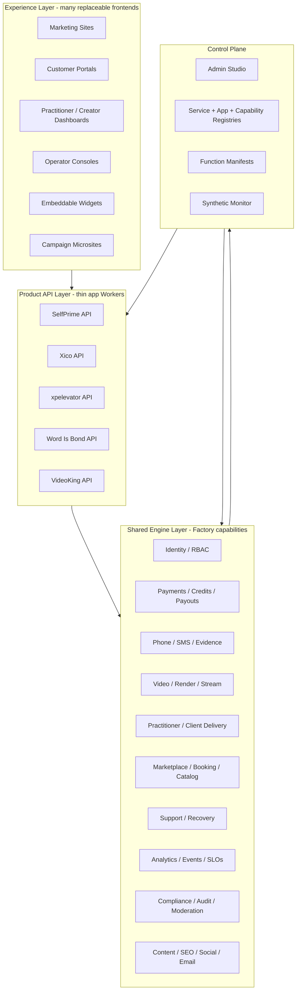
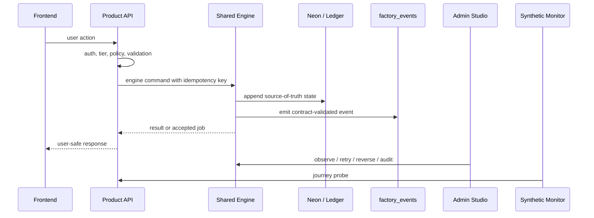
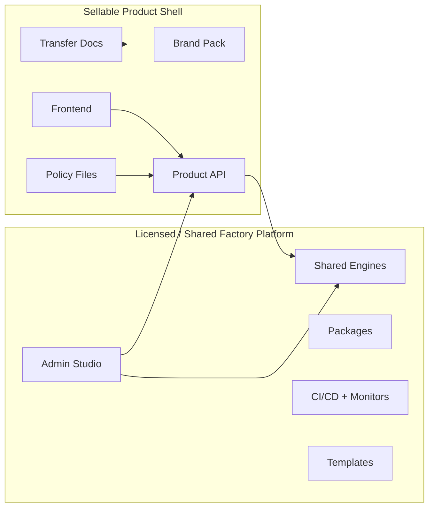
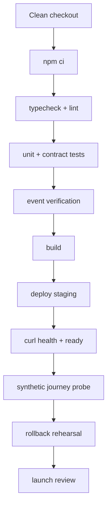

# Factory Modular Operating System Architecture

**Status:** Canonical architecture proposal for World Class 360 execution
**Date:** 2026-05-01
**Owner disciplines:** D01, D05, D07, D08, D09, D10, D11, D12, D13
**Related docs:** `WORLD_CLASS_360_TASK_DASHBOARD.md`, `WORLD_CLASS_360_DISCIPLINE_BREAKDOWN.md`, `ENGINEERING_STANDARDS_CATALOG.md`, `WORKFLOW_COORDINATION_MATRIX.md`, `docs/service-registry.yml`, `docs/APP_SCOPE_REGISTRY.md`

---

## 1. Executive Decision

Factory should be managed as a modular operating system, not as a pile of apps.

The mature architecture is:

1. **Factory owns shared engines, registries, automation, templates, policy, and the control plane.**
2. **Vertical products stay thin and product-specific.**
3. **Frontends become replaceable experience surfaces that call into stable product APIs and engines.**
4. **Admin Studio becomes the operator command center for every engine and app.**
5. **All launch-critical behavior is contract-tested, event-verified, smoke-tested, and visible through manifests.**

This plan is based on the actual repo inventory in this workspace:

| Surface | Real current role |
|---|---|
| `Factory` | Shared packages, Workers, Admin Studio, video scheduling, synthetic monitor, W360 docs, templates, release governance |
| `HumanDesign` | Production SelfPrime/practitioner engine and live proof surface |
| `CallMonitor` | Word Is Bond phone/SMS/call recording/transcription/evidence engine |
| `videoking` | NicheStream video marketplace implementation and monetization pattern source |
| `xico-city` | Factory-built marketplace vertical with W360 full-build plan |
| `xpelevator` | Factory-built learning journey vertical on the shared package stack |
| `prime-self`, `prime-self-ui` | Archived reference repos; not production execution surfaces |
| `Factory-ci-fix`, `HumanDesign-ux-repair-fix` | Fix/review workspaces; not separate product assets |

---

## 2. Architecture North Star

Factory becomes the reusable platform layer. Each product becomes a configured vertical shell.



### What this means in practice

- A new frontend can be created without duplicating phone, video, payments, support, analytics, or auth logic.
- A new vertical can adopt existing engines by configuration and thin route adapters.
- A sellable app can be separated from Factory because the product-specific surface is small and explicitly documented.
- Operator work moves from manual runbooks to Admin Studio actions with dry-run, audit, rollback, and evidence capture.

---

## 3. Boundary Rules

### 3.1 Frontend boundary

Frontends may own:

- routing and presentation
- forms and client validation
- product-specific copy and brand
- onboarding flow layout
- embedded widgets
- logged-in dashboard UX

Frontends must not own:

- secrets
- direct Stripe secret calls
- direct Cloudflare Stream/R2 write tokens
- service-token calls to internal Workers
- source-of-truth entitlement logic
- webhook processing
- final business-state mutation without a product API

### 3.2 Product API boundary

Product APIs may own:

- product-specific permission checks
- user-facing route contracts
- tier gates
- app-specific policy selection
- app-specific data joins
- app-specific event emission
- engine orchestration

Product APIs must not own:

- copied payment webhook primitives
- copied render queue internals
- copied call recording/transcription logic
- copied support/refund/replay logic
- copied analytics schema validators
- copied compliance/audit primitives

### 3.3 Engine boundary

Engines own durable capability contracts:

- package exports
- runtime Worker endpoints where needed
- event schemas
- manifest entries
- smoke probes
- recovery actions
- policy hooks
- audit and idempotency behavior

---

## 4. Real Capability Map

| Capability | Current real home | Target Factory OS shape | First integration target |
|---|---|---|---|
| Phone/SMS/calls | `CallMonitor`, `packages/telephony` | `phone-sms-engine` with call, SMS, transcript, consent, evidence, and support adapters | SelfPrime session follow-up and support workflows |
| Video/render/Stream | `packages/video`, `packages/schedule`, `apps/schedule-worker`, `apps/video-cron`, `apps/video-studio`, `videoking` patterns | `video-engine` with job queue, render dispatch, R2/Stream, moderation, status, replay, credit hooks | Practitioner Video Studio |
| Practitioner/client delivery | `HumanDesign` | `practitioner-engine` contract with client roster, sessions, deliverables, personalized media hooks | SelfPrime paid video proof |
| Marketplace/booking | `xico-city`, `xpelevator`, VideoKing patterns | `marketplace-engine` contracts for catalog, schedule, checkout, reviews, subscriptions, payouts | Xico S-00 through S-11 |
| Payments/credits/payouts | `packages/stripe`, `packages/neon`, W360 entitlement work | `commerce-engine` with signed webhooks, idempotency, ledgers, credit guardrails, Connect payouts | W360-005, W360-014 |
| Support/recovery | `docs/runbooks/operator-support-runbook.md`, Admin Studio routes | `support-engine` with failed render, refund, failed booking, login, data deletion, moderation actions | Admin Studio operator recovery |
| Observability | `packages/analytics`, `packages/monitoring`, `apps/synthetic-monitor` | `observability-engine` with event verification, SLOs, synthetic probes, trace IDs | W360-021, W360-022 |
| Content/growth | `packages/content`, `packages/copy`, `packages/seo`, `packages/social`, `packages/email` | `growth-engine` with launch pages, emails, social posts, SEO artifacts, proof galleries | PVS launch engine and Xico launch package |
| Control plane | `apps/admin-studio`, `apps/admin-studio-ui`, `packages/studio-core` | Admin Studio command center with manifests, registries, health, actions, evidence, drift | W360 AS-06/AS-07 |

---

## 5. Capability Manifest Standard

Every engine and product API should publish a machine-readable manifest entry that Admin Studio can ingest.

Minimum shape:

```yaml
capabilityId: video-engine
ownerDisciplines: [D08, D10, D12]
maturity: beta
runtimeSurfaces:
  - app: schedule-worker
    endpoint: /manifest
    auth: service-token
packages:
  - "@latimer-woods-tech/video"
  - "@latimer-woods-tech/schedule"
events:
  - video.requested
  - video.rendered
  - video.failed
policies:
  - docs/policies/video-render-policy.yaml
smokeProbes:
  - name: schedule-worker-health
    path: /health
    expectedStatus: 200
recoveryActions:
  - retry-render-job
  - reverse-render-credit
  - mark-job-failed
sellability:
  sharedPlatform: true
  productTransferNote: "Products consume this capability by license or service dependency."
```

Implementation home:

- Type contracts: `packages/studio-core`
- Runtime publication: each Worker `/manifest`
- Registry source: `docs/service-registry.yml` plus a new capability registry
- UI: Admin Studio Functions/Services/Release Train tabs

---

## 6. Data And Event Spine

The system should be driven by events, not screen-specific code.



Required event classes:

| Class | Examples | Tests required |
|---|---|---|
| Auth | `user.registered`, `session.created`, `role.changed` | schema, negative auth, rate limit |
| Revenue | `subscription.started`, `checkout.completed`, `credit.debited`, `refund.issued` | webhook signature, idempotency, ledger |
| Video | `video.requested`, `video.render.started`, `video.rendered`, `video.failed` | job lifecycle, retry, credit reversal |
| Phone/SMS | `call.started`, `call.recorded`, `call.transcribed`, `sms.sent`, `sms.failed` | consent, evidence, retry |
| Marketplace | `booking.created`, `booking.confirmed`, `payout.initiated`, `review.posted` | checkout, webhook, cancellation, payout |
| Support | `ticket.created`, `operator.actioned`, `data.exported` | RBAC, audit, SLA |
| Compliance | `consent.captured`, `dmca.takedown.applied`, `data.delete.requested` | audit, retention, operator approval |

---

## 7. Product Shell Pattern

Each sellable app should be a thin shell:



Sellable shell contents:

- product repo
- frontend and product API
- brand pack
- product-specific schema extensions
- policy files
- pricing and legal pages
- customer data map
- domain and deployment map
- transfer runbook
- Factory dependency/license note

Shared Factory contents:

- engine packages
- Admin Studio
- registries
- synthetic monitor
- workflow templates
- support/recovery automation
- shared standards and tests

---

## 8. Implementation Plan

### FMOS-00: Canonical registries

Create or update:

- capability registry
- app registry
- service registry
- workflow registry
- policy registry
- event schema registry

Exit criteria:

- every app and engine has an owner, maturity state, test gate, service surface, and Admin Studio visibility path
- registry validation runs in CI

### FMOS-01: Manifest ingestion

Extend `packages/studio-core` and Admin Studio to ingest capability manifests from Workers and packages.

Exit criteria:

- Admin Studio shows engine health, route metadata, risk tier, owner, smoke status, and recovery actions
- missing manifests fail the graduation gate for new services

### FMOS-02: Policy-driven automation

Introduce policy files for video, commerce, support, phone/SMS, and marketplace flows.

Exit criteria:

- product APIs select policy by app/tenant/tier
- policy tests reject unsafe defaults
- high-risk actions require dry-run and audit

### FMOS-03: Engine extraction and adapters

Extract reusable contracts from real surfaces:

- VideoKing patterns -> video monetization/moderation/payout contracts
- CallMonitor -> phone/SMS/evidence contracts
- HumanDesign -> practitioner delivery/video request contracts
- Xico/xpelevator -> marketplace/learning journey contracts

Exit criteria:

- no second app copies an engine behavior directly
- shared package or Worker contract exists first

### FMOS-04: Admin Studio command center

Add operator actions by risk tier:

- observe
- smoke
- retry
- replay webhook
- reverse credit
- refund
- rollback
- deploy staging
- generate launch report

Exit criteria:

- every mutation has RBAC, dry-run, audit row, rollback/reversal description, and evidence capture

### FMOS-05: App factory

Upgrade scaffolding so new verticals declare engines and generate the correct app shell.

Target command:

```bash
npm run factory:create-app -- --name=xpelevator --template=learning-marketplace --engines=identity,payments,analytics,support
```

Exit criteria:

- new app includes Worker, frontend shell, manifest, events, smoke tests, `.dev.vars.example`, CI, service registry entry, README, runbooks, and launch checklist

---

## 9. Testing And Verification Strategy

| Layer | Test type | Required for |
|---|---|---|
| Package | unit + coverage | every shared package and adapter |
| Worker route | contract + negative auth | every API route with mutation or private data |
| Manifest | schema validation | every Worker and engine |
| Event | `assertEventShape()` and journey event tests | every revenue, booking, video, phone/SMS, support flow |
| Money | webhook signature, idempotency, replay, ledger append-only | Stripe and credit flows |
| Video | job lifecycle, timeout, retry, failed render, credit reversal | schedule-worker/video-cron/render workflow |
| Phone/SMS | consent, call start, transcript, artifact provenance, failure retry | CallMonitor integration |
| Frontend | Playwright, visual, axe, responsive, form validation | every public launch surface |
| Synthetic | health, ready, critical journeys, webhook canaries | live/staging endpoints |
| Recovery | rollback drill, replay drill, refund drill, stuck queue drill | each deployed Worker before public launch |
| Sellability | clean clone, env setup, transfer checklist dry run | every product marked sellable |

Minimum launch gate:



---

## 10. Security, Compliance, And Human-Minimization Rules

1. Humans approve policy and exceptions; systems execute repeatable flows.
2. Every mutation is idempotent, audited, and reversible or explicitly irreversible.
3. Money-moving flows require signed webhooks, idempotency keys, append-only ledgers, and replay tests.
4. Phone/SMS and practitioner data require consent, provenance, retention policy, and export/delete handling.
5. Public AI/video output requires forbidden-claim checks and moderation policy.
6. Frontends never hold privileged tokens.
7. Deploys require automated health checks before status changes to live.
8. Admin Studio actions default to dry-run for T1/T2 risk work.

---

## 11. Sellability Model

Each product gets a transfer score:

| Area | Evidence |
|---|---|
| Code | clean checkout, install, test, build |
| Deployment | domains, Cloudflare projects, secrets inventory, health proof |
| Data | schema map, export/restore path, retention rules |
| Revenue | Stripe products, webhook map, refund and payout runbook |
| Support | operator runbook, ticket flows, escalation |
| Dependencies | Factory packages/engines consumed and license/service terms |
| Brand | brand pack, marketing pages, legal pages |
| Proof | smoke, a11y, synthetic, rollback, launch review |

No app is "sellable" until the transfer runbook has been dry-run by someone who did not build it.

---

## 12. W360 Integration

This architecture does not replace the W360 dashboard. It gives the dashboard a modular execution model.

| W360 work | FMOS dependency |
|---|---|
| W360-005 Practitioner entitlement bridge | FMOS-02 policy + commerce events |
| W360-007 self-serve render | FMOS-03 video engine contracts |
| W360-009 operator recovery | FMOS-04 Admin Studio actions |
| W360-010 through W360-020 Xico | FMOS-05 app factory + marketplace engine |
| W360-021 event verification | FMOS data/event spine |
| W360-022 synthetic SLOs | FMOS launch gate |
| W360-025 release train | FMOS registries and manifests |
| W360-031 through W360-038 governance | FMOS foundation |

---

## 13. Immediate Decision Record

Approved operating assumptions for the next work cycle:

1. **Practitioner Video Studio is the flagship proof** because it exercises SelfPrime, video, payments, credits, Admin Studio, and support recovery.
2. **Xico City is the marketplace proof** because it exercises identity, catalog, booking, checkout, reviews, subscriptions, payouts, compliance, and PWA gates.
3. **CallMonitor is the phone/SMS/evidence source** and should be integrated through contracts before code is moved.
4. **VideoKing remains a pattern source until its live runtime is explicitly registered and health-verified.**
5. **Archived Prime Self repos stay reference-only; HumanDesign is the production SelfPrime surface in this workspace.**
