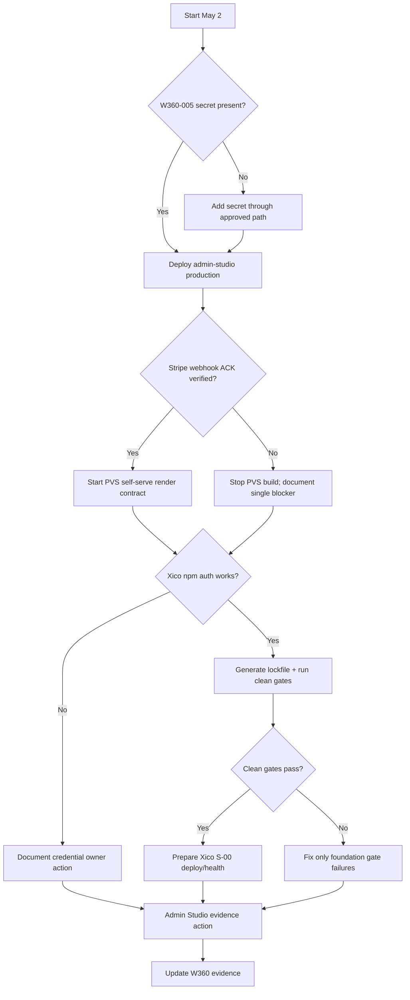

# W360 Tomorrow Action Plan - 2026-05-02

**Status:** Active execution plan for Saturday, 2026-05-02
**Created:** 2026-05-01
**Purpose:** maximize tomorrow's progress while protecting W360 maturity, safety, and automation goals
**Primary outcome:** unblock the highest-value paid loop and the highest-risk vertical foundation without creating more sprawl

---

## 1. Executive Focus

Tomorrow should not be a broad "work on everything" day.

The highest-success plan is:

1. **Close W360-005 or reduce it to a single external-secret blocker.**
2. **Turn Practitioner Video Studio from architecture into executable self-serve sequence.**
3. **Unblock Xico only at the foundation layer: package auth, lockfile, clean gates, deploy proof.**
4. **Make Admin Studio the evidence surface, not just another UI.**
5. **Do not begin feature expansion until gates prove the underlying loop.**

The day is successful if there is less ambiguity, fewer manual steps, and at least one revenue-critical path moves from "blocked" to "verified" or "ready for verification."

---

## 2. Source Inputs

Authoritative local inputs:

- `docs/operations/WORLD_CLASS_360_TASK_DASHBOARD.md`
- `docs/operations/FACTORY_MODULAR_OPERATING_SYSTEM_ARCHITECTURE.md`
- `docs/service-registry.yml`
- `docs/APP_SCOPE_REGISTRY.md`
- `docs/operations/WORKFLOW_COORDINATION_MATRIX.md`
- `docs/revenue/PRACTITIONER_VIDEO_STUDIO_READY_STATE_PLAN.md`
- `docs/revenue/XICO_CITY_TRANCHE_REVIEW.md`
- `docs/runbooks/operator-support-runbook.md`

External note:

- The shared Sauna URL was checked on 2026-05-01, but the fetched page exposed only a dynamic shell and no readable plan content. Treat the user-provided W360 dashboard text and local repo docs as the authoritative inputs for this action plan.

---

## 3. Tomorrow's Non-Negotiable Rules

1. **Do not start new feature surfaces before closing the P0 runtime gates.**
2. **Do not mark anything live without direct HTTP verification.**
3. **Do not move secrets through docs, chat, or committed files.**
4. **Do not copy engine logic into product apps. Add package/Worker contracts first.**
5. **Every completed item must leave evidence: command, run ID, endpoint response, test result, or commit.**
6. **Every money-moving mutation must have idempotency and replay/reversal handling.**
7. **Every UI change that touches launch surfaces must pass visual, mobile, and a11y gates.**

---

## 4. Highest-Leverage Work Blocks

### Block A - 45 minutes: Morning verification and branch hygiene

Goal: make sure the day starts from known truth.

Actions:

1. Capture current Factory status:

   ```bash
   git status --short --branch
   git log --oneline -5
   ```

2. Capture external repo status for `HumanDesign`, `CallMonitor`, `videoking`, `xico-city`, and `xpelevator`.
3. Re-read W360 P0/P1 rows only.
4. Create a short evidence note in the day's working log or PR description.

Success signal:

- everyone knows which repo is dirty, which branch is active, and which blockers are real today.

Stop condition:

- if Factory working tree contains unrelated active changes, isolate docs-only or use a focused branch before touching code.

### Block B - 90 minutes: W360-005 Practitioner Studio entitlement bridge

Goal: close the configuration blocker or prove the exact remaining secret/action needed.

Current known blocker:

- `STRIPE_SUBSCRIPTION_WEBHOOK_SECRET` is missing from repo secrets.
- Admin Studio production health is reportedly 200.
- schedule-worker `/stripe/health` is reportedly 200.

Actions:

1. Verify current live endpoints:

   ```bash
   node scripts/verify-http-endpoint.mjs --url https://admin-studio-production.adrper79.workers.dev/health --expected-status 200
   node scripts/verify-http-endpoint.mjs --url https://schedule-worker.adrper79.workers.dev/stripe/health --expected-status 200
   ```

2. Confirm secret presence through GitHub Actions/gh metadata, without printing values.
3. If missing, add the secret through the approved GitHub secret path.
4. Rerun `deploy-admin-studio.yml` for production.
5. Run Stripe test webhook ACK verification.
6. Record run ID, endpoint, HTTP status, and result in the W360 dashboard row.

Success signal:

- W360-005 becomes DONE, or its only remaining blocker is a named external credential action.

Do not proceed to PVS-02 until:

- signed webhook ACK is verified
- entitlement/credit event shape is verified
- failure behavior is documented

### Block C - 2 hours: PVS executable contract

Goal: define the first self-serve paid render path with contracts and tests before UI buildout.

Actions:

1. Write or update the PVS route contract:

   - plan catalog
   - checkout session
   - signed webhook
   - entitlement grant
   - credit ledger debit
   - render request
   - job status
   - playable output
   - failed render recovery

2. Define event schemas:

   - `studio.plan.viewed`
   - `studio.checkout.started`
   - `studio.subscription.activated`
   - `studio.credit.granted`
   - `studio.render.requested`
   - `studio.render.completed`
   - `studio.render.failed`
   - `studio.credit.reversed`

3. Define tests before implementation:

   - bad webhook signature rejected
   - duplicate webhook idempotent
   - render request without credits rejected
   - render request with credits creates schedule job
   - failed render reverses credit exactly once
   - public render requires moderation policy

4. Add the contract to the appropriate PVS plan doc and link it from the W360 dashboard.

Success signal:

- the first self-serve render path is implementable by following contract and tests, not by inventing behavior inside a frontend.

### Block D - 90 minutes: Xico foundation unblock

Goal: resolve or precisely isolate the Xico package-auth blocker.

Actions in `C:/Users/Ultimate Warrior/Documents/GitHub/xico-city`:

1. Verify `.npmrc` references the approved GitHub Packages auth pattern.
2. Confirm `npm whoami --registry=https://npm.pkg.github.com` or equivalent non-secret auth check.
3. Run:

   ```bash
   npm install
   npm run typecheck
   npm run lint
   npm test
   npm run build
   ```

4. If install succeeds, commit lockfile in Xico.
5. If install fails, capture only the error class and required owner action.

Success signal:

- W360-003 moves from package-auth blocked to clean-gate execution, or the remaining unblock is a single named credential owner action.

Do not start Xico S-01 until:

- lockfile exists
- clean gates pass
- S-00 deploy/health path is known

### Block E - 90 minutes: Admin Studio evidence surface

Goal: make Admin Studio prove the platform rather than merely describe it.

Actions:

1. Confirm manifest ingestion for:

   - admin-studio
   - schedule-worker
   - video-cron
   - synthetic-monitor

2. Identify missing app/engine visibility:

   - PVS entitlement bridge
   - schedule-worker jobs
   - failed render recovery
   - synthetic journey probes
   - release train drift

3. Add or update one Admin Studio issue/plan row for the next visible operator action:

   - retry render
   - reverse credit
   - replay webhook
   - run smoke probe
   - record deploy evidence

Success signal:

- next Admin Studio work is tied to one operator action and one evidence object.

### Block F - 60 minutes: End-of-day evidence and next-step pruning

Goal: prevent tomorrow's work from turning into another sprawl layer.

Actions:

1. Update W360 rows touched during the day.
2. Update service/app/capability registry if any runtime truth changed.
3. Record test commands and run IDs.
4. Archive or mark any stale docs discovered during execution.
5. Prepare the next day's 3-item priority list.

Success signal:

- a new agent can resume without verbal context.

---

## 5. Recommended Timebox

| Time | Work |
|---|---|
| 09:00-09:45 | Block A: verification and branch hygiene |
| 09:45-11:15 | Block B: W360-005 entitlement bridge |
| 11:15-13:15 | Block C: PVS executable contract |
| 13:15-14:00 | Break / buffer |
| 14:00-15:30 | Block D: Xico foundation unblock |
| 15:30-17:00 | Block E: Admin Studio evidence surface |
| 17:00-18:00 | Block F: evidence, dashboard update, next-step pruning |

---

## 6. Decision Tree



---

## 7. Maturity Gates For Tomorrow

| Gate | Pass condition |
|---|---|
| Verification | all changed status claims cite command/run/endpoint evidence |
| Modularity | no product app receives copied engine internals |
| Automation | at least one manual step becomes script, workflow, manifest, or checklist evidence |
| Revenue safety | webhook and credit behavior is idempotent and test-planned |
| Operator readiness | Admin Studio has one concrete next operator action tied to a real failure/recovery path |
| Xico discipline | no feature slices start before X0/S-00 gates |
| Documentation hygiene | touched docs link back to the canonical dashboard |

---

## 8. Expected Best Outcome

By end of day on 2026-05-02:

1. W360-005 is closed or reduced to one external credential dependency.
2. PVS has an executable self-serve render contract with test cases.
3. Xico either has a lockfile and clean-gate results or a single named auth blocker.
4. Admin Studio has a concrete evidence/action slice for operator recovery.
5. W360 dashboard reflects evidence-backed status, not intent.

## 9. Work To Avoid Tomorrow

Avoid these until the above outcomes are true:

- building a new PVS frontend before entitlement and credit contracts are verified
- beginning Xico S-01 feature routes before S-00 foundations pass
- moving CallMonitor code into Factory without a contract
- treating VideoKing as a live dependency without service registry health proof
- creating more broad strategy docs without wiring them to tests, manifests, or W360 rows
