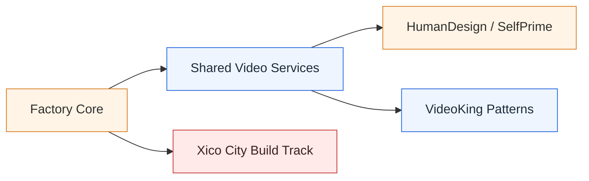
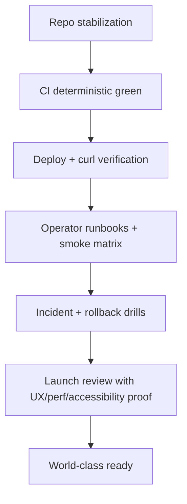
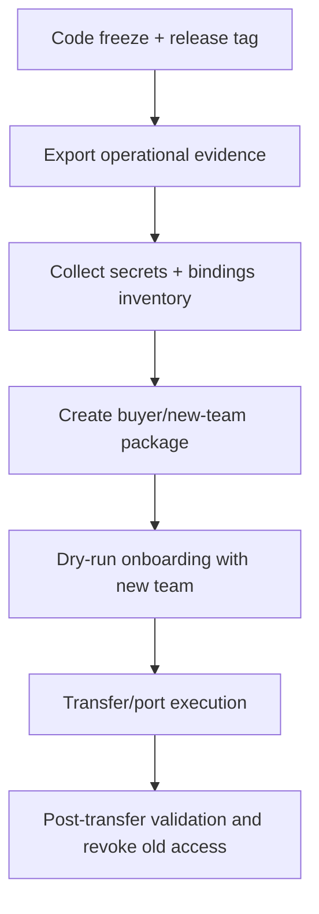
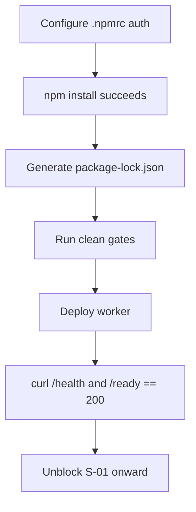

# Warm Handoff Portfolio Master Report (2026-04-30)

## Audience and Intent

This document is the warm, operator-friendly handoff package for the next team.
It answers:

- Where we stand right now
- What is complete vs blocked
- What must happen before Factory, VideoKing, HumanDesign, Xico City, and shared synergies are world-class and launch-ready
- What must be prepared before a clean project portability/transfer
- What is most likely missing from a first-pass transition plan

This report should be read alongside:

- `docs/ESSENTIAL_OWNERS_GUIDE.md`
- `docs/runbooks/getting-started.md`
- `docs/runbooks/transfer.md`
- `docs/operations/WORLD_CLASS_360_TASK_DASHBOARD.md`
- `docs/service-registry.yml`
- `docs/APP_SCOPE_REGISTRY.md`

---

## Executive Snapshot

### Current portfolio posture

- Factory core platform is strong and documented, but not yet in a fully green CI posture on main.
- HumanDesign has landed major telemetry and accessibility hardening work; core deterministic gate is green, but visual/frontend workflows remain unstable.
- VideoKing is currently a pattern source/reference plus external implementation surface; internal Factory record still treats it as not live-deployed.
- Xico City is partially unblocked but still blocked on package auth + lockfile workflow before build/deploy gates can be considered complete.
- SelfPrime x Video synergies are now clearer and safer: shared infrastructure should remain in Factory, while product-specific behavior stays app-side.

### Readiness verdict (today)

- Factory: `not-ready-for-handoff-without-bridge-plan`
- HumanDesign: `near-ready-with-known-ci-exceptions`
- VideoKing: `reference-ready-not-runtime-consolidated`
- Xico City: `blocked-on-foundation-gates`
- Synergy layer: `architecture-ready-execution-partial`

---

## Portfolio Inventory and Current State

| Domain | Repo/Surface | Current State | Evidence Source |
|---|---|---|---|
| Factory control repo | `Latimer-Woods-Tech/factory` | Active; many docs/ops artifacts present; current main CI entries include failures | `gh run list`, `PROJECT_STATUS.md`, `WORLD_CLASS_IMPLEMENTATION_DASHBOARD.md` |
| HumanDesign (SelfPrime app repo) | `_external_reviews/humandesign` | Recent telemetry parity + a11y fixes landed and pushed; deterministic gate green; visual/frontend deploy workflows failing | local git log + `gh run list` |
| VideoKing reference in Factory | `apps/videoking` + docs | Treated as pattern/reference surface, not live worker | `docs/service-registry.yml`, `SELFPRIME_VIDEOKING_SYNERGY_DEVELOPMENT_PLAN.md` |
| VideoKing external implementation | `_external_reviews/videoking` | Rich implementation and docs; status report says staging-ready (self-reported) | `_external_reviews/videoking/PROJECT_STATUS_REPORT.md` |
| Xico City | external repo `xico-city` (tracked by W360 docs) | Partially unblocked: vitest/script fixes landed; still blocked by npm auth (`@latimer-woods-tech/*`) and lockfile generation | `WORLD_CLASS_360_TASK_DASHBOARD.md` |
| Synergy infrastructure | `apps/schedule-worker`, `apps/video-cron` | Health checks verified 200 on 2026-04-29; smoke checks documented | `docs/service-registry.yml`, `SELFPRIME_VIDEOKING_SYNERGY_DEVELOPMENT_PLAN.md` |

---

## Where We Stand by Program

## 1) Factory

### Strengths

- Clear policy framework (`CLAUDE.md`) and runbook depth.
- Strong package and service registry discipline.
- W360 planning artifacts are extensive and execution-oriented.

### Gaps

- Main branch CI still has recent failures.
- Working tree in the Factory repo is highly active; handoff needs a stabilization branch and checkpoint.
- Multiple workflows and app paths are changing simultaneously, raising merge/ownership risk if not tightly coordinated.

### Must happen before “world-class and ready”

1. Stabilize main CI to consistent green for core pipelines.
2. Close/triage all open W360 blockers that affect launch-critical routes.
3. Freeze a release candidate branch and produce verified deploy evidence for critical workers/pages.
4. Publish one canonical “operator run sequence” and enforce it.

## 2) HumanDesign

### Strengths

- Three-shell discoverability parity work is landed.
- Guided-client telemetry additions and regression tests are in.
- Deterministic gate is passing on latest SHA.

### Gaps

- Playwright visual tests failing (wait-for-shell timeout pattern).
- Frontend deploy workflow has failures on latest SHA.
- Some repo docs indicate status snapshots that need a single canonical handoff summary.

### Must happen before “world-class and ready”

1. Resolve visual test determinism and environment routing assumptions.
2. Stabilize frontend deploy workflow.
3. Run one full green evidence sweep and archive proof artifacts.
4. Publish one-page operator smoke matrix with exact expected outputs.

## 3) VideoKing

### Strengths

- Strong architecture and monetization model documented.
- External implementation appears mature with extensive docs and tests.
- Useful source of reusable patterns (moderation, payouts, video ops).

### Gaps

- Factory service registry still marks VideoKing as reference/not deployed.
- Runtime truth and docs truth are split across Factory vs external review surfaces.
- Transfer readiness depends on deciding whether VideoKing is reference-only or promoted runtime.

### Must happen before “world-class and ready”

1. Decide canonical runtime posture: reference-only vs production app.
2. If promoted: register canonical endpoints and verify `/health` with curl.
3. Consolidate operator docs so one team can run without context switching between repos.

## 4) Xico City

### Strengths

- Full-scope W360 plan exists.
- Partial stabilization landed (vitest compatibility + missing scripts).

### Gaps

- Still blocked by package auth to install dependencies.
- Missing lockfile and clean gate completion prevents deploy progression.
- Entire S-00 to S-11 chain remains blocked from foundational steps.

### Must happen before “world-class and ready”

1. Configure npm auth for GitHub packages.
2. Generate lockfile and pass clean gate (`install`, `typecheck`, `lint`, `test`, `build`).
3. Deploy and curl-verify `health` and `ready` endpoints.
4. Progress slices in strict order (identity → onboarding → catalog → checkout → trust/payout/compliance).

## 5) Synergies (Factory x SelfPrime x Video systems)

### Strengths

- Architecture boundary is documented correctly: shared infra in Factory, product logic in app.
- Shared video workers are live-health verified.

### Gaps

- Remaining execution to fully operationalize moderation, telemetry contracts, and cross-app operator controls.
- Need tighter release train and incident playbook coupling across shared and app-specific surfaces.

### Must happen before “world-class and ready”

1. Enforce app-tenancy and visibility contracts end-to-end in scheduling/render flows.
2. Standardize job lifecycle telemetry and SLO dashboards.
3. Add deterministic recovery drills (failed render, failed webhook, stuck queue).

---

## Visual Aids

### A) Portfolio readiness map

### B) World-class completion dependency chain

### C) Portability and handoff artifact pipeline

### D) Xico unblock critical path

---

## Handoff Bundle Checklist (for new team)

## 1) Mandatory docs bundle

- Owner manual: `docs/ESSENTIAL_OWNERS_GUIDE.md`
- Getting-started runbook: `docs/runbooks/getting-started.md`
- Transfer runbook: `docs/runbooks/transfer.md`
- Service registry: `docs/service-registry.yml`
- W360 active dashboard: `docs/operations/WORLD_CLASS_360_TASK_DASHBOARD.md`
- App scope registry: `docs/APP_SCOPE_REGISTRY.md`
- This master report: `docs/operations/WARM_HANDOFF_PORTFOLIO_MASTER_REPORT_2026-04-30.md`

## 2) Operations evidence bundle

- Latest green CI references per repo
- Latest deploy URLs and explicit curl outputs
- Smoke-test scripts and expected responses
- Incident runbook and rollback command set
- Secrets inventory and owner map (without secret values in docs)

## 3) Platform portability bundle

- Repo transfer readiness per app
- Database export/restore strategy per app
- Cloudflare project/worker ownership map
- DNS/domain transfer sequence
- Access revocation sequence and checklist completion logs

---

## Definition of Complete (for this handoff)

This handoff is complete when all conditions below are true:

1. New team can clone, install, run, test, and verify each critical surface without verbal guidance.
2. Every launch-critical service has a documented endpoint and a recent curl verification result.
3. Every blocked item has explicit owner, unblock condition, and first execution command.
4. Transfer/port procedure has been dry-run in staging and signed off by both teams.
5. Service registry, app scope registry, and W360 dashboard are mutually consistent.

---

## What You Likely Missed (high-value catches)

1. Canonical truth drift risk:
   The same status is represented in multiple docs; ownership of updates must be explicit per document.

2. CI success vs runtime success gap:
   Green CI is not enough; enforce direct endpoint checks in release evidence.

3. External-review dependency risk:
   HumanDesign and VideoKing reference repos are rich but can drift from Factory assumptions.

4. Transfer rehearsals are often skipped:
   Run one full staging transfer simulation before any production portability event.

5. Secrets/documentation split:
   Teams often hand over docs without a binding/secret owner matrix and rotation calendar.

6. Xico critical-path fragility:
   Until package auth and lockfile are stable, downstream build plans are effectively frozen.

7. Visual regression fragility in HumanDesign:
   Resolve shell-ready assumptions before declaring frontend workflow stability.

---

## 14-Day Transition Plan (recommended)

### Days 1-3: Stabilize and normalize

- Freeze branch policy for handoff period.
- Resolve top failing workflows in Factory and HumanDesign.
- Reconcile service-registry status with observed deploy reality.

### Days 4-7: Prove transfer readiness

- Build complete ownership matrices (repo, domain, infra, secrets, support).
- Run staging portability dry-run with full checklist.
- Produce and archive evidence snapshots.

### Days 8-11: Unblock strategic blockers

- Complete Xico auth/install/lockfile stabilization.
- Close HumanDesign visual/frontend deploy instability.
- Confirm shared video services telemetry and recovery drills.

### Days 12-14: Final handoff rehearsal

- New team executes the runbooks end-to-end.
- Founding team shadows and only answers clarifying questions.
- Sign final handoff acceptance with action log for remaining post-handoff backlog.

---

## Final Note

This portfolio is close to a strong transfer posture, but not yet “fully world-class and portable” until CI/runtime verification and cross-repo consistency are tightened. The fastest path is to treat this as an operations-hardening sprint, not a feature sprint.
